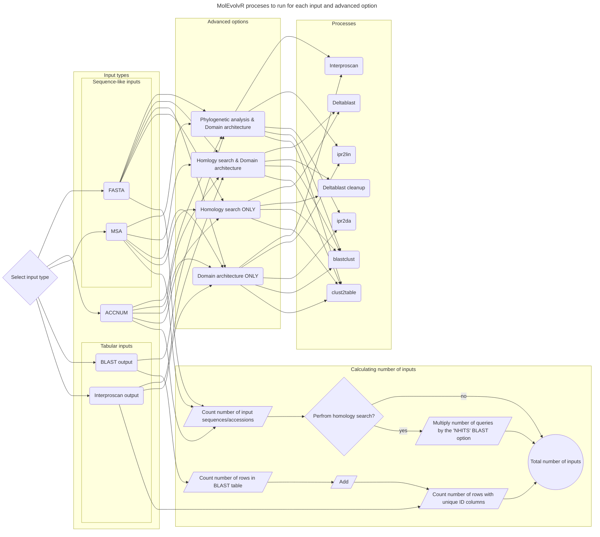

# MolEvolvR diagram for mapping input types and advanced options to backend processes

## How to export as PNG/SVG?

The simplest way is to copy and paste the `mermaid` code block into mermaidchart.com and export.

Mermaid CLI is not used because I/we have not installed the [node module](https://github.com/mermaid-js/mermaid-cli/tree/master#mermaid-cli) 
on the server hosting the MolEvolvR application.

